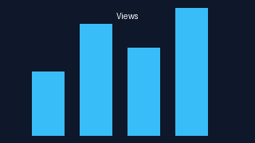

Meme Generator
==============

Automates a Reddit-to-vertical-video workflow tuned for short-form posts.

https://www.reddit.com/r/teenagers/comments/1e642tw/what_the_states_look_to_me_as_german/ - original Reddit Post 
https://www.instagram.com/reel/DHEiVjbTS3_ - rendered Instagram Reel

Goal
----
Automate the formatting and rendering of high-performing, publicly available Reddit posts into animated vertical stories suitable for Instagram, TikTok, and similar channels -- turning static threads into branded video content with minimal manual effort.

Results
-------
The automation pipeline allowed dozens of clips to be produced per day. Once scheduled, the edits consistently attracted millions of impressions and multiple viral hits. The workflow now powers an internal marketing branch as a reusable content engine.

Features
--------
- Pulls hot/top posts for configured subreddits (`src/meme_generator.py`).
- Screens downloads with a TensorFlow NSFW classifier plus OCR-based bad-word detection.
- Builds 9:16 edits with optional overlays, LUTs, particles, emoji layers, and a configurable watermark.
- Writes renders to `output/<date>/rendered/`, ready for upload.

Customization
-------------
All layers -- backgrounds, overlays, LUTs, emoji, audio beds, and watermarks -- are user-supplied. Swap branding kits, typography, or animation packs in `assets/` to tailor the output for any campaign or company style guide.

Quick Start
-----------
1. `pip install -r requirements.txt`
2. Copy `.env.example` -> `.env`, add Reddit credentials, and point to FFmpeg/ImageMagick/Tesseract if needed.
   - Drop `assets/models/nsfw.299x299.h5` in place or provide a working `NSFW_MODEL_URL`. The script falls back to `https://storage.googleapis.com/nsfw_model/nsfw.299x299.h5` if your value fails.
3. Populate the folders under `assets/` with your own media (see `assets/README.md` for guidance).
4. Run `python src/meme_generator.py`.

Credits
-------
- TensorFlow & TensorFlow Hub (NSFW classifier)
- MoviePy & ffmpeg-python (video composition)
- OpenCV (video frame sampling)
- Pillow (image processing)
- pytesseract (OCR)
- Requests (remote fetches)
- PRAW (Reddit API client)

All heavy assets stay local; only placeholders are tracked in Git. Customize the script as needed and rerun to generate fresh clips.
